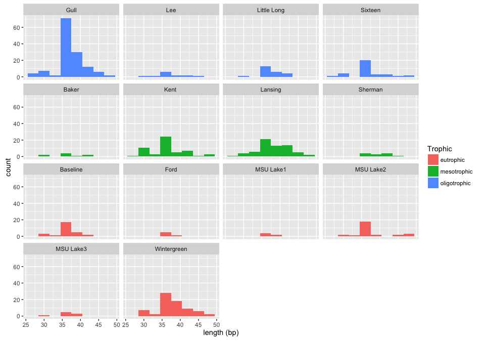
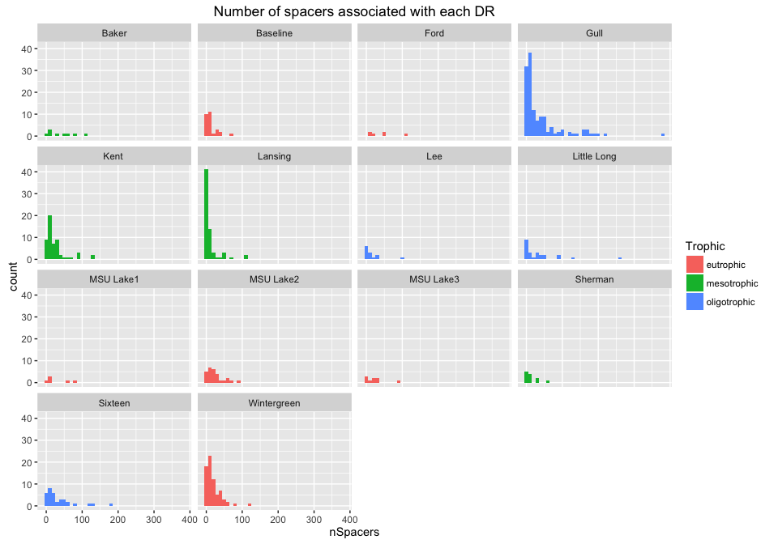
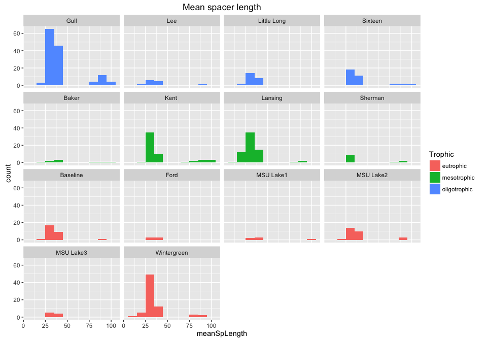
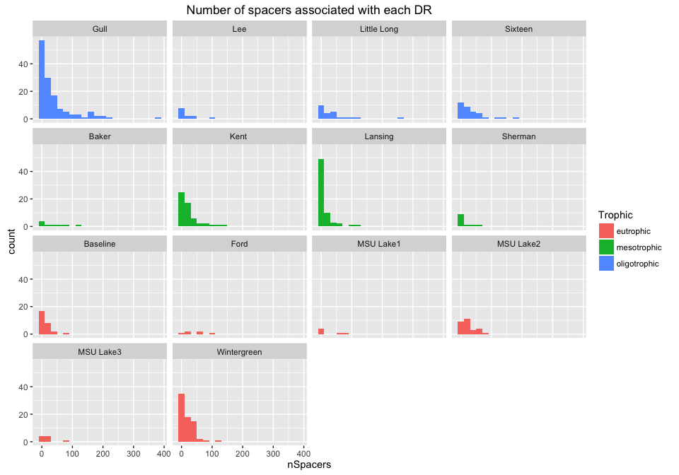

# CRISPRs from inland lake *Microcystis* cultures


```r
library(ggplot2)
library(dplyr)
library(magrittr)
library(pander)
panderOptions("table.split.table", Inf) 
```

#### Read in Crass data

```r
setwd("~/git_repos/chabs-virus/inland-lake/data/crispr-stats/")

# Read in a list of sample dataframes 
crispr_dfs <- lapply(dir(), function(x) {read.csv(x, sep = "\t")} )
names(crispr_dfs) <- dir() %>%
  substr(1, 12)

# Add a column to each dataframe with the sample name
crispr_dfs <- Map( 
  function(df, name) {
    mutate(df, Sample = name)
  }, 
  crispr_dfs, 
  names(crispr_dfs)
)

crisp <- do.call(what = "rbind", args = crispr_dfs)

names(crisp) <- c("GID", "DR", "DRVariants", "Length", "nSpacers", 
  "meanSpLength", "meanSpCoverage", "nFlankers", "meanFlLength", "Reads", "Sample")
```

#### Read in inland lake metadata 

```r
sample_data <- read.csv("~/git_repos/chabs-virus/inland-lake/data/mc-inland-sampledata.csv")

# Join with crass data
crisp %<>%
  mutate(SampleDigits = as.numeric(substr(Sample, 8, 12))) %>%
  left_join(sample_data, by = c("SampleDigits" = "SampleID")) 

crisp$Lake = factor(crisp$Lake, levels = c("Gull", "Lee", "Little Long",
    "Sixteen", "Baker", "Kent ", "Lansing", "Sherman", "Baseline", "Ford",
    "MSU Lake1", "MSU Lake2", "MSU Lake3", "Wintergreen"
))
```


```r
head(crisp)
```

```
##     GID                                     DR DRVariants Length nSpacers
## 1    G2  GTTCCAATTAATCTTAAGCCCTATTAGGGATTGAAAC          1     37       84
## 2    G5   GCTTCTGACTTCCTCGGAAGTTGAATTAATGGAAAC          1     36       56
## 3   G52    AAACTTGAAGGAAAACTTGAAGGAAAACTTGAAGG          1     35        3
## 4 G1578 ATCCTTACCTATTAGGTCAAATAGGATTAGTTGGAAAC          1     38        6
## 5 G1579  CCCTTACCTATTAGGTCAAATAGGATTAGTTGGAAAC          1     37       10
## 6 G1580 AACCTTACCTATTAGGTCAAATAGGATTAGTTGGAAAC          1     38        6
##   meanSpLength meanSpCoverage nFlankers meanFlLength Reads       Sample
## 1           35             41         2           91  3569 Sample_44284
## 2           36             40         4           99  2641 Sample_44284
## 3           96              2         1           25   371 Sample_44284
## 4           34             20         1           26   224 Sample_44284
## 5           37             21         3           39   363 Sample_44284
## 6           36             20         1           26   186 Sample_44284
##   SampleDigits  Strain      Lake    TP   Trophic        Date      Lat
## 1        44284 L111-01 MSU Lake1 163.5 eutrophic  2011-08-19 42.68059
## 2        44284 L111-01 MSU Lake1 163.5 eutrophic  2011-08-19 42.68059
## 3        44284 L111-01 MSU Lake1 163.5 eutrophic  2011-08-19 42.68059
## 4        44284 L111-01 MSU Lake1 163.5 eutrophic  2011-08-19 42.68059
## 5        44284 L111-01 MSU Lake1 163.5 eutrophic  2011-08-19 42.68059
## 6        44284 L111-01 MSU Lake1 163.5 eutrophic  2011-08-19 42.68059
##       Long
## 1 -84.4831
## 2 -84.4831
## 3 -84.4831
## 4 -84.4831
## 5 -84.4831
## 6 -84.4831
```

```r
n_crisprs <- length(levels(crisp$DR))
```

There are 311 unique CRISPRs in this dataset

# Direct Repeats

## Direct repeat length

```r
ggplot(crisp, aes(x = Length, fill = Trophic)) + 
  geom_histogram(binwidth = 3) +
  facet_wrap(~Lake) + 
  xlab("length (bp)")
```



```r
  ggtitle("Microcystis culture DR lengths")
```

```
## $title
## [1] "Microcystis culture DR lengths"
## 
## attr(,"class")
## [1] "labels"
```


## Number of DR types per culture

```r
crisp_count <- crisp %>%
  count(Sample) %>%
  arrange(n)

ggplot(crisp_count, aes(x = n)) +
  geom_histogram(binwidth = 5) +
  ggtitle("Number of DR types in each culture")
```




## Most frequent DR's across samples
firstTrophy is the trophic state of the first sample of the given DR type.    
nTrophy is the number of trophic statuses represented by all samples with that
DR type. If nTrophy = 3, that DR is present in lakes of all trophic statuses.   
   

```r
crisp %>%
  group_by(DR) %>%
  summarize(meanNSpacers = mean(nSpacers), count = n(),  firstTrophy = first(Trophic),
            nTrophy = n_distinct(Trophic)) %>%
  arrange(desc(count)) %>%
  slice(1:10) %>%
  pander() 
```


--------------------------------------------------------------------------------------
                  DR                     meanNSpacers   count   firstTrophy   nTrophy 
--------------------------------------- -------------- ------- ------------- ---------
 CCTTACCTATTAGGTCAAATAGGATTAGTTGGAAAC     24.448276      29      eutrophic       3    

  CTTTTAACTTCTTAGCAAGTTTAATTAATGGAAAC     104.107143     28    oligotrophic      3    

  CTTCTGACTTCCTCGGAAGTTGAATTAATGGAAAC     60.750000      24      eutrophic       3    

 GTTCCAATTAATCTTAAGCCCTATTAGGGATTGAAAC    51.071429      14      eutrophic       3    

 GTTCCAATTAATCTTAAGTCCTATTAGGGATTGAAAC    30.000000      13     mesotrophic      3    

  CTTGCTTCCAATTCGTGAAGCGTATGAATGGAAAC     16.818182      11    oligotrophic      3    

 GTTCCAATTAATCTTAAACCCTATTAGGGATTGAAAC    56.222222       9    oligotrophic      3    

AGTTCCAATTAATCTTAAACCCTATTAGGGATTGAAACC    5.285714       7      eutrophic       2    

 GTGATCAACGCCTTACGGCATCAAAGGTTAGTACAC     22.833333       6    oligotrophic      2    

AGTTTCAATCCCTAATAGGGTTTAAGATTAATTGGAACC    8.500000       4      eutrophic       2    
--------------------------------------------------------------------------------------


## Are we double counting DR's with their reverse complement?


```r
# Look for the reverse complement of the most common DR (in 29 samples)
# CCTTACCTATTAGGTCAAATAGGATTAGTTGGAAAC
match1 <- grep(pattern = "GTTTCCAACTAATCCTATTTGACCTAATAGGTAAGG", x = crisp$DR)

crisp$DR[match1]
```

```
## [1] GTTTCCAACTAATCCTATTTGACCTAATAGGTAAGGA 
## [2] GTTTCCAACTAATCCTATTTGACCTAATAGGTAAGGA 
## [3] CCGTTTCCAACTAATCCTATTTGACCTAATAGGTAAGG
## [4] GTTTCCAACTAATCCTATTTGACCTAATAGGTAAGGAA
## [5] GTTTCCAACTAATCCTATTTGACCTAATAGGTAAGGAA
## 311 Levels: AAACTTGAAGGAAAACTTGAAGGAAAACTTGAAGG ...
```
So these are not the same, but they are very similar with just a couple of extra
nucleotides thrown in . . . interesting


```r
# Look for the reverse complement of the second most common DR (in 28 samples)
# CTTTTAACTTCTTAGCAAGTTTAATTAATGGAAAC
match2 <- grep(pattern = "GTTTCCATTAATTAAACTTGCTAAGAAGTTAAAAG", x = crisp$DR)

crisp$DR[match2]
```

```
## [1] GTTTCCATTAATTAAACTTGCTAAGAAGTTAAAAGA     
## [2] GTTTCCATTAATTAAACTTGCTAAGAAGTTAAAAGA     
## [3] GTTTCCATTAATTAAACTTGCTAAGAAGTTAAAAGA     
## [4] AGTTTCCATTAATTAAACTTGCTAAGAAGTTAAAAG     
## [5] CCTTTTGTTTCCATTAATTAAACTTGCTAAGAAGTTAAAAG
## 311 Levels: AAACTTGAAGGAAAACTTGAAGGAAAACTTGAAGG ...
```

Same thing

# Spacers

## Mean length of spacers

```r
ggplot(crisp, aes(x = meanSpLength, fill = Trophic)) + 
  geom_histogram(binwidth = 10) +
  facet_wrap(~Lake) + 
  ggtitle("Mean spacer length")
```



## Number of spacers per DR type

```r
ggplot(crisp, aes(x = nSpacers, fill = Trophic)) + 
  geom_histogram(binwidth = 20) +
  facet_wrap(~Lake) + 
  ggtitle("Number of spacers associated with each DR")
```




## DR's with highest mean spacer count

```r
crisp %>%
  group_by(DR) %>%
  summarize(meanNSpacers = mean(nSpacers), count = n(), firstTrophy = first(Trophic),
            nTrophy = n_distinct(Trophic)) %>%
  arrange(desc(meanNSpacers)) %>%
  slice(1:10) %>%
  pander() 
```


----------------------------------------------------------------------------------------------
                      DR                         meanNSpacers   count   firstTrophy   nTrophy 
----------------------------------------------- -------------- ------- ------------- ---------
     GTTTCCATTAATTAAACTTGCTAAGAAGTTAAAAGA          136.3333       3      eutrophic       2    

      ATAACTGATAACTGATAACTGATAACTGATAACTG          133.0000       1     mesotrophic      1    

AACTGATAACTGATAACTGATAACTGATAACTGATAACTGATAACT     125.0000       1    oligotrophic      1    

         ACGTTTCCCGCACACGCGGGGATGAACCG             116.0000       1      eutrophic       1    

  AACTGATAACTGATAACTGATAACTGATAACTGATAACTGATA      111.0000       1     mesotrophic      1    

GTTGTGATTTGCTTTCAGATTATGTTCTTTGATAGATTGCGTACAGA    108.0000       1     mesotrophic      1    

      CTTTTAACTTCTTAGCAAGTTTAATTAATGGAAAC          104.1071      28    oligotrophic      3    

        GTCGCCCCTTCGCGGGGGCGTGGATCGAAAC            104.0000       2    oligotrophic      1    

     GTTCCAATTAATCTTAAACCCTACTAGGGATTGAAAC         101.3333       3     mesotrophic      1    

     AACTGATAACTGATAACTGATAACTGATAACTGATAA         88.0000        1      eutrophic       1    
----------------------------------------------------------------------------------------------

# Next steps

- Make a phylogeny of DR's
- See if there is correlation with the 16S (seems like no)
- Can we identify core DR's and group them with their "variants"? Does this tell
us anything new
- Are DR's associated with any other host trait?
- Similarity of spacers between isolates from the same lake vs different lakes -
can we answer this with any existing database? 

