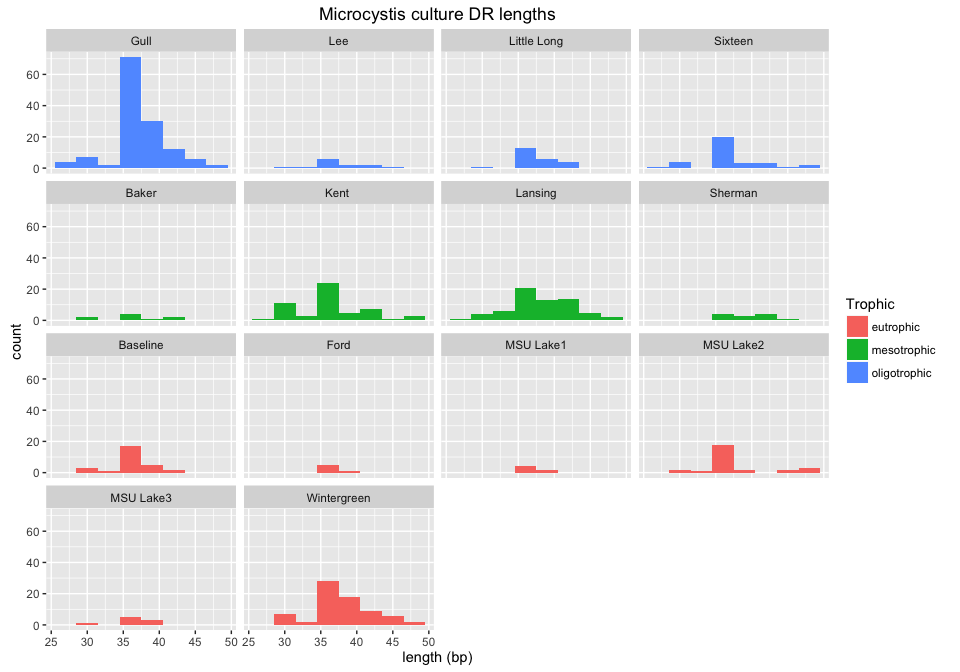

# CRISPRs from inland lake *Microcystis* cultures


```r
library(ggplot2)
library(dplyr)
library(DT)
library(magrittr)
```

#### Read in Crass data

```r
setwd("~/git_repos/chabs-virus/inland-lake/data/crispr-stats/")

# Read in a list of sample dataframes 
crispr_dfs <- lapply(dir(), function(x) {read.csv(x, sep = "\t")} )
names(crispr_dfs) <- dir() %>%
  substr(1, 12)

# Add a column to each dataframe with the sample name
crispr_dfs <- Map( 
  function(df, name) {
    mutate(df, Sample = name)
  }, 
  crispr_dfs, 
  names(crispr_dfs)
)

crisp <- do.call(what = "rbind", args = crispr_dfs)

names(crisp) <- c("GID", "DR", "DRVariants", "Length", "nSpacers", 
  "meanSpLength", "meanSpCoverage", "nFlankers", "meanFlLength", "Reads", "Sample")
```

#### Read in inland lake metadata 

```r
sample_data <- read.csv("~/git_repos/chabs-virus/inland-lake/data/mc-inland-sampledata.csv")

# Join with crass data
crisp %<>%
  mutate(SampleDigits = as.numeric(substr(Sample, 8, 12))) %>%
  left_join(sample_data, by = c("SampleDigits" = "SampleID"))
```


```r
head(crisp)
```

```
##     GID                                     DR DRVariants Length nSpacers
## 1    G2  GTTCCAATTAATCTTAAGCCCTATTAGGGATTGAAAC          1     37       84
## 2    G5   GCTTCTGACTTCCTCGGAAGTTGAATTAATGGAAAC          1     36       56
## 3   G52    AAACTTGAAGGAAAACTTGAAGGAAAACTTGAAGG          1     35        3
## 4 G1578 ATCCTTACCTATTAGGTCAAATAGGATTAGTTGGAAAC          1     38        6
## 5 G1579  CCCTTACCTATTAGGTCAAATAGGATTAGTTGGAAAC          1     37       10
## 6 G1580 AACCTTACCTATTAGGTCAAATAGGATTAGTTGGAAAC          1     38        6
##   meanSpLength meanSpCoverage nFlankers meanFlLength Reads       Sample
## 1           35             41         2           91  3569 Sample_44284
## 2           36             40         4           99  2641 Sample_44284
## 3           96              2         1           25   371 Sample_44284
## 4           34             20         1           26   224 Sample_44284
## 5           37             21         3           39   363 Sample_44284
## 6           36             20         1           26   186 Sample_44284
##   SampleDigits  Strain      Lake    TP   Trophic        Date      Lat
## 1        44284 L111-01 MSU Lake1 163.5 eutrophic  2011-08-19 42.68059
## 2        44284 L111-01 MSU Lake1 163.5 eutrophic  2011-08-19 42.68059
## 3        44284 L111-01 MSU Lake1 163.5 eutrophic  2011-08-19 42.68059
## 4        44284 L111-01 MSU Lake1 163.5 eutrophic  2011-08-19 42.68059
## 5        44284 L111-01 MSU Lake1 163.5 eutrophic  2011-08-19 42.68059
## 6        44284 L111-01 MSU Lake1 163.5 eutrophic  2011-08-19 42.68059
##       Long
## 1 -84.4831
## 2 -84.4831
## 3 -84.4831
## 4 -84.4831
## 5 -84.4831
## 6 -84.4831
```

```r
n_crisprs <- length(levels(crisp$DR))
```

There are 311 unique CRISPRs in this dataset

# Direct repeat length

```r
ggplot(crisp, aes(x = Length, fill = Trophic)) + 
  geom_histogram(binwidth = 3) +
  facet_wrap(~Lake) + 
  ggtitle("Microcystis culture DR lengths")
```



# Number of spacers per DR type

```r
ggplot(crisp, aes(x = nSpacers, fill = Trophic)) + 
  geom_histogram(binwidth = 10) +
  facet_wrap(~Lake) + 
  ggtitle("Number of spacers associated with each DR")
```


# Number of DR types per culture

```r
crisp_count <- crisp %>%
  count(Sample) %>%
  arrange(n)

ggplot(crisp_count, aes(x = n)) +
  geom_histogram(binwidth = 5) +
  ggtitle("Number of DR's in each sample")
```


# DR's with highest mean spacer count

```r
crisp %>%
  group_by(DR) %>%
  summarize(meanNSpacers = mean(nSpacers), count = n(), firstTrophy = first(Trophic),
            distTrophy = n_distinct(Trophic)) %>%
  arrange(desc(meanNSpacers)) %>%
  datatable()
```

<!--html_preserve--><div id="htmlwidget-4079" style="width:100%;height:auto;" class="datatables"></div>
<script type="application/json" data-for="htmlwidget-4079">{"x":{"data":[["1","2","3","4","5","6","7","8","9","10","11","12","13","14","15","16","17","18","19","20","21","22","23","24","25","26","27","28","29","30","31","32","33","34","35","36","37","38","39","40","41","42","43","44","45","46","47","48","49","50","51","52","53","54","55","56","57","58","59","60","61","62","63","64","65","66","67","68","69","70","71","72","73","74","75","76","77","78","79","80","81","82","83","84","85","86","87","88","89","90","91","92","93","94","95","96","97","98","99","100","101","102","103","104","105","106","107","108","109","110","111","112","113","114","115","116","117","118","119","120","121","122","123","124","125","126","127","128","129","130","131","132","133","134","135","136","137","138","139","140","141","142","143","144","145","146","147","148","149","150","151","152","153","154","155","156","157","158","159","160","161","162","163","164","165","166","167","168","169","170","171","172","173","174","175","176","177","178","179","180","181","182","183","184","185","186","187","188","189","190","191","192","193","194","195","196","197","198","199","200","201","202","203","204","205","206","207","208","209","210","211","212","213","214","215","216","217","218","219","220","221","222","223","224","225","226","227","228","229","230","231","232","233","234","235","236","237","238","239","240","241","242","243","244","245","246","247","248","249","250","251","252","253","254","255","256","257","258","259","260","261","262","263","264","265","266","267","268","269","270","271","272","273","274","275","276","277","278","279","280","281","282","283","284","285","286","287","288","289","290","291","292","293","294","295","296","297","298","299","300","301","302","303","304","305","306","307","308","309","310","311"],["GTTTCCATTAATTAAACTTGCTAAGAAGTTAAAAGA","ATAACTGATAACTGATAACTGATAACTGATAACTG","AACTGATAACTGATAACTGATAACTGATAACTGATAACTGATAACT","ACGTTTCCCGCACACGCGGGGATGAACCG","AACTGATAACTGATAACTGATAACTGATAACTGATAACTGATA","GTTGTGATTTGCTTTCAGATTATGTTCTTTGATAGATTGCGTACAGA","CTTTTAACTTCTTAGCAAGTTTAATTAATGGAAAC","GTCGCCCCTTCGCGGGGGCGTGGATCGAAAC","GTTCCAATTAATCTTAAACCCTACTAGGGATTGAAAC","AACTGATAACTGATAACTGATAACTGATAACTGATAA","GGCTCCCCCGCACCCGCGGGGATCGACCC","AACTGATAACTGATAACTGATAACTGATAACTGATAACTGATAA","GTAACTATCCACTCCCCCACCCGAAGGTGAGGGAGAC","GTGCTCAACGCCTTTCGGCATCAGAGATGCGACAC","GTCTCAATCCCTTCAACTACAGGGCTGGTACTGAAC","CTCTCTACTCGCTAGAGAAATTAATTGAATGGAAAC","ATGATAGCCGCTCAGAGATCGCGGTCCAGCGGCAAC","AGTGTAACCGAGCGACGCTCCCCGCCAAACCACGGC","CTTCTGACTTCCTCGGAAGTTGAATTAATGGAAAC","GTTCCAATTAATCTTAAACCCTATTAGGGATTGAAAC","GCTTCTGACTTCCTCGGAAGTTGAATTAATGGAAAC","GTTCCAATTAATCTTAAGCCCTATTAGGGATTGAAAC","GTCCTGAATAGGCCCAAAGCCGAAAGGCACTGAAGAC","GCTTCAAAGCCTCTGAAACCCTTTTAGGGATTGAAAC","CCGACCCCGGGCGGAAACGCCCGGGCCTCATTGAAGC","CCTGTCGTTTACCACATTTTGCAATCAAATCACAAC","GCTGTAAATAAGCACGTTTTGAAAGCCATTCACAAC","AAAGTTCCAATTAATCTTAAGCCCTATTAGGGATTGAAAC","AGGACTATCCCCGCATGTACGGGGGAATG","CCCTCTACTCGCTAGAGAAATTAATTGAATGGAAAC","CGGGCCATCCCCGCGTGGGCGGGGAAACC","ACAGTCTTTTAACTTCTTAGCAAGTTTAATTAATGGAAACTAA","AAAGTTTCCATTAATTCAACTTCCGAGGAAGTCAGAAG","GGTCGATCTCAACTAAATCCCGCGATCGGGACTGAAAC","GTCGCCCGTCAGGAAACTGGCGGGCGTGGATTGAAAC","CGGATCATCCCCGCATGCGCGGGGAACGC","GTTGTGAGTTATCCCATGAAATTAAAGAACTGAAAGCAAATCACAAC","AAGGTTTTTAGATTTATTCAGCAAACCCTA","GTTCCAATTAATCTTAAGCCCTACTAGGGATTGAAAC","CTTCTCAGCCATCTACGCGATGGCGAAC","GTTGTGATTTGCTTTCAGATTGTGTTCTTTGATAGATTGCATACAGA","GGCTGCCCCGCGTATGCGGGGATGGACCC","GCATCGCCCGCCTTCATCGGCGGGCGCGGATTGAAAC","ACTGGATGCAATCTATCAAAGAACACAATCTGAAAGCAAATCACAAC","GTCGCCCGGCTCATGCGAGTCGGGCGTGGATTGAAAC","GTCGCCCCTCCCGCAGGGGCGTGGGTCGAAAC","GTTTCAATCCCTAATAGGGTTTAAGATTAATTGGAACAATA","CAAGTTTCCATTAATTCAACTTCCGAGGAAGTCAGAAG","GTAACAATCCACTCCCACACCCGAGGGTGAGGGAGAC","GTTGTGAATTGCTTTCATTTTTGAGTATCTTTGAGATATGACACAAC","AGTTTAGCCGATAGGGATTTGCGGTCCAGCCGCAAC","GCTTCAACGGGGCCGAGCCACGAGGGCCCGGAGAAC","GTTCCAATTAATCTTAAGTCCTATTAGGGATTGAAAC","GCTGCGGCTTGCGGTCGCCCCTCGTTTTGCTACAAC","CTTCTAAGCCGCCCACGTGGCGGAGAAC","AGCCTACCCGATGGGAGTCGGTAGGGAAACCACGGC","ACTGTCTGCAATCTATCAAAGAACACAATCTGAAAGCAAATCACAAC","CGGTTCATCCCCACGGGTGTGGGGCGTGC","AGTTTCAATCCCTAGTAGGGTTTAAGATTAATTGGAAC","CCTTACCTATTAGGTCAAATAGGATTAGTTGGAAAC","GCTGCGGATTGCAGCCCTTTCTCGTTCTGCTAGAAC","GTTTCAATCCACTCTCTTCATTGCTGAAGAGAGAAAC","GCTTCAACGAGGCCGGGCTTCGTGGGCCCGGAGAAC","CGGTTCATCCCCGCGTCTGCGGGGCACAC","GGCTGCCCCGCGTGAGCGGGGATCGACCC","GTGATCAACGCCTTACGGCATCAAAGGTTAGTACAC","AGTGTAATCGAGCGACGCTTCCGGCGAAACCACGGC","AGGGTTGATTCAGGGTAGGGTTGATTCATGAATCAACCCTAC","GCTGCTTCAACGGGGCCGAGCCACGAGGGCCCGGAGAAC","GTGTCGAATCTCTGATGCCGAAAGGCGTTGAGCACA","AGGGTAGGGTTGATTCATGAATCAACCCTAC","AGCTGTGGCCGGGAGCGATCGCCCGCTTCGTTACACT","GTTCTCAGCTTCGGCTGAGGCGAACTAATGGAAAC","AAGGTTCCAATTAATCTTAAACCCTATTAGGGATTGAAAC","AGTGTATTCGGTCCCGCTCTGCGACCAGCCCGCAAC","AACTGATAACTGATAACTGATAACTGATAACTGATTA","GTTTCACTACCAAAACCCCGCAAGGGGACGGAAAC","GGTGTTGTTTTCGGGTACAAGTTACAATTTGAAAGCAATTCACAAC","CCTTCCACGTCGACGACGACGTGGCTCCGTTGAAGC","ACTCCTTACCTATTAGGTCAAATAGGATTAGTTGGAAAC","ATTTCCGCGACTTCCATATCGCGGCCTCATTGAAGC","CTCGCAATCTCTCTTGTGGAGATGAATTAATGGAAAC","ACTTCTCAGCCATCTACGCGATGGCGAAC","CTTGCTTCCAATTCGTGAAGCGTATGAATGGAAAC","GGGACCATCCCCGCGCGAGCGGGGGAACC","ATTATCCAAGACACCTTTCCACCGAAATAGGACTGAGAC","GATTGTAGCTATCCGGGGTGAGAGAGGGAGCTACAAC","GTGCCGTTCGCCCCGATGCCGTGAGGCGTTGAGCAC","GCTTCAATGGGGCCGCGTCGTTGGGACGCGGAAGAC","CTTCTGACTTCCTCGGAAGTTGAATTAATGGAAACC","GTTTCCAACTAATCCTATTTGACCTAATAGGTAAGGA","CCTTCGCCGCTCGTGAGAGCGGCGCTCCATTGAAGC","AGTTTCCATTAATTCAACTTCCGAGGAAGTCAGAAG","GCAACGCGCGCGCCTCGGCGCGCGCGAGGATTGAAAC","GGGACCATCCCCGCGTAGGCGGGGGAACC","CAGTTCCAATTAATCTTAAACCCTATTAGGGATTGAAACATCG","AGTTGTGATTTGCTTTCAACAAACGATCTTTGACAAC","AGTGTATTCGAGCGGTGCTTCCGGCCCGCCCACGGCG","GTCCGGGCTTTTCCCCGTTTGAGAGGGGATTGAAAC","AGTGTATCAGAACGGAGCCTGTCCGCGAACCCCAACC","GAGGCTGCCCCGCGTATGCGGGGATGGACCC","ACACCCCACACCCTGCCCCCAGGAAAAACTTTTTGCCGCAAACCCTA","ACTGATTACTGATTACTGATTACTGATTACTGATTACTGATTACTG","ATTTCAATTCCACTCAGGTACGATTAGAAG","GTCGCGACTCACACGAGTCGCGTGGATTGAAAC","AGTGTAACCAACCTCAGCCCGGGATCAATTTGCAAC","AGTGTATCAGAACGGAGCCTGTCCGCGAACCCCAAC","AGTGTATCAGAACGGAGCCTGTCCGCGAACCCCAACA","CGAGGTTCTCCGGGCCCACGAAGCCCGGCCTCGTTGAAGC","ATGTTTCAATCCCTAATAGGGTTTAAGATTAATTGGAAC","AGTGTAACGAAGCGGGCGATCGCTCCCGGCCACAGCCG","AGTTCCAATTAATCTTAAGTCCTATTAGGGATTGAAACT","CGAGGATAGCCGTTCAGAAATCGGGGTCCAGCCGCAAC","AGTTCCAATTAATCTTAAACCCTATTAGGGATTGAAACAACG","CCCTTACCTATTAGGTCAAATAGGATTAGTTGGAAAC","TTCACTGATTACTGTTTACTGTTTACTGATCACTGAAAAA","GTTTCAATCCTTGTTGTGTTGGATCATTGGCTAAGTCAA","AGGTTTCCATTCATACGCTTCACGAATTGGAAGCAAG","GTCTCAGTCCTATTTCGGTGGAAAGGTGTCTTGGATGCAAA","AAGGTTCCAATTAATCTTAAACCCTATTAGGGATTGAAACT","ATTGTAAGCCATCCGGGGTGAGAGAGGGAGCTACAACA","ACTTCAATCGGACTGGGTGGAATTGAAAT","AGTGTAACGAAGCGGGCGATCGCTCCCGGCCACAGCAG","AGTGTAACGAAGCGGGCGATCGCTCCCGGCCACAGCG","CCTTTTGTTTCCATTAATTAAACTTGCTAAGAAGTTAAAAG","AGCCTACCAGGGAGAGATCGGTAGGGAAACCACGGC","GTTCACTGATTACTGTTTACTGTTTACTGATCACTGAAAA","AAGTTTCCATTCAATTAATTTCTCTAGCGAGTAGAGAG","GAGCCTACCACAGGGAAGACGGTAGGGAAGCCACGGC","AACTGATAACTGATAACTGATCACTGATAACTGATAACTGA","GGCGACAGCACCGCTTCCCCGCTCAGGGGATTGAGAC","AAATCCAAGACACCTTTCCACCGAAATAGGACTGAGAC","GAATCCAAGACACCTTTCCACCGAAATAGGACTGAGAC","CTCCGTTTCAATCCCTAATAGGGCTTAAGATTAATTGGAAC","AGTGCTCAACGCCTTTCGGCATCAGAGATTCAACAC","CATTCCCCCGCACACGCGGGGATAGTCC","CGGTTCATCCCCGCGGGTGCGGGGAACAC","AGTTTCAATCCCTAATAGGGTTTAAGATTAATTGGAACC","CAGCTTCAATGATGCCGCAGCGATTAGCTGCGGAAGAC","CCGGGGTTCCCCCGCACCCGCGGGGATCGACCC","ACTGATTACTGTTTACTGTTTACTGATCACTGAAAAAGCTTC","AGGCTTCAAAGCCTCTGAAACCCTTTTAGGGATTGAAAC","AATGTTTCAATCCACTCTCTTCATTGCTGAAGAGAGAAAC","TTCGTTTCTCTCTTCAGCAATGAAGAGAGTGGATTGAAACAA","CGCATCACCCGGCTGAAAAGCCGGGTGCGGATTGAAAC","ATCGGCACCCCCCTTATCAAGGGGGGCAGGGGGGATCGAACC","CCGCGGTTCAGCCCCGCGTGCGCGGGGACGACG","AGTTTCAATCCACGCGACTCGTGTGAGTCGCGAC","AGTTTCCATTAATTAAACTTGCTAAGAAGTTAAAAG","GCTGCGGCTTGCGGTCGCCCCTCGTTTTGCTACAACA","GTCTTAGCAGAAACGACGGCGAGGCCCAACCGCAAC","GGTTTCAATCCACTCCCACCGATGAAAGTGGGAGGAAC","ATGTTTCAATCCCTAATAGGGTTTAAGATTAATTGGAACTG","AGCAGTTCCAATTAATCTTAAACCCTATTAGGGATTGAAACAT","GTTCCAATTAATCTTAAGCCCTATTAGGGATTGAAACAGA","AAGTTTCCATTCAATTAATTTCTCTAGCGAGTAGAGAGTCAA","AAGTTTCCATTAATTCAACTTCCGAGGAAGTCAGAAGA","ACGTTGTCCCCGCGCGAGCGGGGATGGACCG","GTCTCAGTCCTATTTCGGTGGAAAGGTGTCTTGGATATGAAC","AACCCCTAAGGGGTAAGCACTACGTGCAACCCCTAAGGGGT","AGTTTCAATCCCTAATAGGACTTAAGATTAATTGGAAC","ATCAGTAAACAGTAAACAGTAATCAGTGAA","CAGTTCCAATTAATCTTAAACCCTATTAGGGATTGAAACATTGC","AATGTTTCCATTAATTCAACTTCCGAGGAAGTCAGAAG","ATTTCAATACCCGAAGGTCCGATTGATAC","GGGGGTCGATCCCCCCTTAATCCCCCCTTGATAAGGGGGGTGTCTGA","CCAGGGTCGATCCCCGCGGGTGCGGGGGAACC","GTTTCCAACTAATCCTATTTGACCTAATAGGTAAGGAA","AACCTTACCTATTAGGTCAAATAGGATTAGTTGGAAAC","ATCCTTACCTATTAGGTCAAATAGGATTAGTTGGAAAC","ATGTTTCCATTCAATTAATTTCTCTAGCGAGTAGAGAGAAAAA","CAGTTCTCCGGGCCCTCGTGGCTCGGCCCCGTTGAAGCA","ATCTACAACAGTAGAAATTTTATCCACCCGTTAGGG","ACTGTTTACTGTTTACTGATCACTGTTTACTGATCACTGTTCACTG","CCGTTTCCAACTAATCCTATTTGACCTAATAGGTAAGG","GCTGGTAACACCTTTCAAAACAAAGGCAATCACAGC","CCAGACCGCCGTCAGCGACCTTGCCCCCCTCGCCG","ATCAGTAAACAGTAATCAGTAATCAGTGAA","ATCAGTAAACAGTAAACAGTAATCAGTGAACTGAAAACTC","ACTGATTACTGATTACTGTTTACTGATCACTGAAAAAAGCT","CCGTTCCCCCTACGCAGGGGGATGAACCGGC","GTGCTCAACGCCTTTCGGCATCAGAGATTCGACACGA","CAGTTCCAATTAATCTTAAACCCTATTAGGGATTGAAACA","TCAGTTCACTGATTACTGTTTACTGTTTACTGATCACTGAAAA","TCAACTCAATTCAACTCAATTCAACTCAATTCA","GTTCACTGATTACTGTTTACTGTTTACTGATCACTGAAAAA","AGTTCCAATTAATCTTAAACCCTATTAGGGATTGAAACC","AATGTTTACTGTTTACTGATTACTGTTTACTGATCACTG","CAGTAAACAGTAAACAGTAAACAGTAAACAGTAAACAGTAA","GCGTTCTAGCAGAGGCGACGGCGCGGCCCAACCGCAAC","AGGTTCCAATTAATCTTAAACCCTATTAGGGATTGAAACTTG","ATACCTTACCTATTAGGTCAAATAGGATTAGTTGGAAACTA","TTCACTGATTACTGATTACTGTTTACTGATCACTGAAAA","CTCGTCGCTCCCCTCGCGGGAGCGTGGATCGAAAC","TACCTTACCTATTAGGTCAAATAGGATTAGTTGGAAACTA","AGTTGCAATGACCACCCGAAAACGGGGTGGCCGCACC","ATGAACATGAACATGAACATGAACATGAACATGAACATGAA","CACGTCTCAGTCCTATTTCGGTGGAAAGGTGTCTTGGATACAAA","GTTTCCATTCAATTAATTTCTCTAGCGAGTAGAGAGAAAA","GTTCCAATTAATCTTAAGCCCTATTAGGGATTGAAACTGGTAA","GGGAACATTAACATTAACCAACAATACAATAACAGGTAATA","AAGATTGTTGGTCGGGAGACCAACAATAACAAAA","CAGCCTAGCCGATGGGGGAATGGGGGCCAACCGCAACG","GTCAGAGTGCCACTTCCAGTAGAACAAGGATTAAGAC","AGTGTTCCCCACGCGCGTGGGGATGAACCG","ACTGATAACTGATCACTGATAACTGATAACTGATAA","CATCACTCCATCATCACTCCATCATCACTC","GACAAGACAAGACAAGACAATCACAAGACAATCACAAGACAAGA","AACCTTACCTATTAGGTCAAATAGGATTAGTTGGAAACA","AATGTTCCAATTAATCTTAAGCCCTATTAGGGATTGAAAC","TACCTTACCTATTAGGTCAAATAGGATTAGTTGGAAACTAGATA","GGTTCTAGCAGAGGCGACGGCGCGGCCCAACCGCAAC","AGAACGTAGGTTGGGTTGAAGCATGAAACCCAACGCCCGCTTA","GTTTCCATTCAATTAATTTCTCTAGCGAGTAGAGAGAA","GTTTCCATTCAATTAATTTCTCTAGCGAGTAGAGAGTCA","ATTTTCTAACGCTCCAATTTCCTTACCAATTTCCTTACCAATTTC","ACTGTTTACTGATTACTGCTCACTGATTACTGATCACTG","AACCCTAACCCTAACCCTAACCCTAAACCCTAACCCTAACCC","CGGTTCCTCCGCCCACGCGGAGATGCACCC","GGTTCCAATTAATCTTAAACCCTACTAGGGATTGAAAC","AATAAATTAAATTAAATTAAATTAAATTAAATTAAATTAAA","ACAATCCTCAATTAAGTGGAACAATTCCTCCTGAACTTGGTAATCT","ATATTGAGATTTAGATTGTTGGTCAGGCGACCAACAATAA","ATTGGCAATCTTACTTCTCTTCAATATTTAGATTTATCA","CCATCACCTGAACCATCACCTGAACCATCACCTGAACCATC","AAGTCTCAGTCCTATTTCGGTGGAAAGGTGTCTTGGATGT","ACCATCCAAGACACCTTTCCACCGAAATAGGACTGAGACA","ATCAGTGATCAGTAATCAGTAATCAGTAATCAGTAAACAGTAA","GGATCCAAGACACCTTTCCACCGAAATAGGACTGAGAC","ACGGGAGGGGAACGACGGGAGGGGAACGACGGGAGGGGAACGACGG","CGACCTGTCGCCGCTGGCGGGCCTGACCGCGCTGGAG","AAATCAGTTATCAGTGATCAGTTATCAGTTATCAGTGATCAGTT","CCAATTTCCTTGCCAATTTCCTTACCGATTTC","CGTCGTCCCCGCGCACGCGGGGCTGAACCGC","ATAAGTTTCCATTAATTCAACTTCCGAGGAAGTCAGAAGAA","AGGTAGGACTTGAGGTAAGACTTGAGGTAGGACTTGAGGTA","CCTTCCCGTAGTGGACGAGGCAACGAGACC","AATCGAATAGAATCATCGAATGGACTCGAATGGAATCATC","GAAGAAGAAGAAGAAGAGGAAGAGGAAGAGGAAGAGGAAGAGGAAGA","GTTCCAATTAATCTTAAGCCCTATTAGGGATTGAAACACA","AAACGTTTCAATCCCTAAAAGGGTTTCAGAGGCTTTGAAGC","GGTGCTCAACGCCTTTCGGCATCAGAGATGCGACACA","ACCCTAAAACCCTAAAACCCTAAAACCCCAACACCCC","ATCAAAAATTTGACAGTCTCCAAAAAGATGTTAATCA","ACACATATCAAACACATCCATCAAACACATCCATCACACA","AGAACAGATAAAGAACAGATAAAGAACAGAACAGAACAGAAA","ATATTGAGATTTAGATTGTTGGTCAGGCGACCAACAATAAC","CACGGTCGATCCCCGCGGGTGCGGGGGAACCG","GATGATGAGGAAGAAGTAGATGAGGTGGGAGAGAGGA","TATCAAAACACATATCAAAACACATATCAAAACACATATCAAAA","CCGCCGCCTTGCGGACGGTCGCCATATTGACG","CCCTAAAACCCTAAAACCCTAAAACCCCAA","AAACTTGAAGGAAAACTTGAAGGAAAACTTGAAGG","GCTCGCAATCTCTCTTGTGGAGATGAATTAATGGAAAC","AGCCGTAGCCGTAGCCGTAGCCGTAGCCGTAGCCGTAACCCTA","CAAGGTATTGAACAAGGTATTGAACGAGGTATCGAAC","GGCACCCCCCTTATCAAGGGGGGATTAAGGGGGGATCAA","CTCTCTACTCGCACTTAGAAATTAATTGAATGGAAAC","AAAACGACTCTGACCCCTTTCGGATATTCCG","GAACAAGGTATTGAACAAGGTATCGAACAAGGTATCGAAC","ACTGTTTACTGATCACTGTTTACTGATCACTGTTTACTGATCACTG","AGAGGAAGGTAGAGAGGAAGGTAGAGAGGAAGGTAGAGAAGAAGGTA","CTAAAACCCTAAAACCCTAAAACCCCAACACCCCAAAACCC","GGCTTCAACGGGGCCGAGCCACGAGGGCCCGGAGAAC","ACTGTTTACTGTTTACTGATCACTGTTTACTGATTACTGAT","AACTGATCACTGATAACTGATAACTGAT","GGTATCGAACAAGGTATTGAACAAGGTATTGAACAAGGTATTGAAC","CAGTAATCAGTAATCAGTAATCAGTAATCAGTAATCAGTGA","TTAACTCTTAACTCTTTAACTCTTAACTCTTAA","GTTTCCATTAATTCATCTCCACAAGAGAGATTGCGAGAA","GAAGTGTATTCGGTCCCGCTCTGCGACCAGCCCGCAAC","AGCCTACCAATTGGGAGTCGGTAGGGAAACCACGGCGA","CTATCCCGGGCGGAAACGCCCGGGCCTCATTGAAGCC","AGTCGCGCCCCGCGTGGGCGCGTGGATTGAAAC","ATAACAGGATCGCCCTTTGCATTCCTATCCCAAGCAATG","CACAACCACAATCACAACCACAACCACAATCACAACCACAA","CGTATTGCTTTGACAAGTGGTGAACCACTTCTCTACGGGGTTC","GAAGCATGTAGAGAAGTGATTCATCACTTCTCAAAGCA","GCGCTCCCCCCGTCCTACGCTTTCCTAAGCGTAGAACGGGTTA","GGGGGTAATGAACCCCGTAGAGAAGTGATTCATCACTTCTCA","GAACAAGGTATTGAACAAGGTATTGAACAAGGTATTGAAC","AGCCGTATTACCTGTTATTGTATTGTTGGTTAATGTTAATGTTCCC","CCCATCACCCGGAGTGACCCTGAATTTGTGGGGTGGCCGCAAC","CGCGGTGGACGGTCACCAAAGCCACCGCC","AGCCTAACCGATGGGGGAATGGGGGCCAACCGCAACGA","GGTTATATCCCCCTAAATCCCCCTTGATAAGGGGGACTTGA","CCCCGGAGTGACCCTGAATTTGTGGGGTGGCCGCAACGG","CTTGTCGTTCTTGTTCTTTTTCTAAAAGAGCCTGTTCTTTTGC","GAACAAGGTATTGAACAAGGTATTGAACAAGGTATCGAAC","TCGGCGAAGAAGGCGGCACCAAGCCTGGCAA","CGGACCATCCCCACACCCGTGGGGAAAACCC","ATCAGTAATCAGTGATCAGTAATCAGTAATCAGTAATCAGTAA","GTAGGTTGGGTTGAGGCACGAAACCCAAC","ACTACTGACTACTGACTCCTGACTCCTGACT","ATCAAGGGGGATCCCCCCGCCTATCGGCACCCCCCTTATCAAGGGGG","CAGCACGTTACCGAGATTGTTGTAGGCATAGACA","CCACGCCCAACGCCACGCCCAACGCCACGCCCAAC","ACTGCTCACTGATTACTGCTCACTGATTACTG","CAGTTCCAATTAATCTTAAACCCTATTAGGGATTGAAACGTATCC","ACTCCCACACCAACACCTTCTCCAACTCCTTCTCCAACTCC","AAACCCTAAAACCCTAAAACCCTAAACCCTAAAACCCTAAACCC","CGTCCCCGATCTCCGCTTCGCTTCGTCGGGGATGACAAG","CGTCTTTTAACTTCTTAGCAAGTTTAATTAATGGAAACG","GGTTCCAATTAATCTTAAGCCCTATTAGGGATTGAAACA","AATCAACACAATCAACACAATCAACACAATCAACAA","AATGAAATGAGTTGAATGAATGAAATGAGTTGAATGAATGAAATGAA","AGCAAAGCAAAGCAAAGCAAAGCAAAGCATAGCAAAGCAAAGCA","CAACCAACTCCCCAGCCCACACCTCAACCAACTCC","CCCGGAGTGACCCTGATTTTGTGGGGTGGCCGCAACA","GAACCAACTGCAGAACCAACTGCTGAACCAACTGCTGAACC","GAGCAAGAGCAAGAACAAGACGAGCAAGAGCAAGAGCAAGA"],[136.333333333333,133,125,116,111,108,104.107142857143,104,101.333333333333,88,74,70,68,67,63.5,62,62,61,60.75,56.2222222222222,56,51.0714285714286,51,50.5,49.5,48,48,48,47,45.6666666666667,45,44,43.6666666666667,43,42,41.75,38,37,36,36,35.6666666666667,35.6666666666667,35,34,34,33,32,32,32,32,31,30.5,30,29,28.5,28,28,27,26,24.448275862069,24,24,23.25,23,23,22.8333333333333,22,22,21,21,21,21,21,20,20,20,20,19,19,18,18,17,17,16.8181818181818,16,16,16,16,16,16,15,15,15,15,15,15,14,14,14,14,14,14,13.5,13,13,12,12,12,12,12,12,11,11,11,10,10,10,10,10,10,10,10,10,10,10,9,9,9,9,9,9,9,9,9,9,9,9,8.5,8,8,8,8,8,8,8,8,8,8,8,8,8,8,7.66666666666667,7.5,7,7,7,7,7,7,7,7,7,7,7,7,7,6.5,6,6,6,6,6,6,6,6,6,6,6,6,6,6,6,6,6,5.5,5.28571428571429,5,5,5,5,5,5,5,5,5,5,5,5,5,5,5,5,5,5,5,5,5,4.66666666666667,4.66666666666667,4,4,4,4,4,4,4,4,4,4,4,4,4,4,4,4,4,4,4,4,4,4,4,4,4,4,4,4,4,4,4,4,4,4,4,4,4,4,4,4,3.5,3.5,3,3,3,3,3,3,3,3,3,3,3,3,3,3,3,3,3,3,3,3,3,3,3,3,3,3,3,3,3,3,3,3,3,3,3,3,3,3,3,3,3,3,3,3,3,3,3,3,3,3,3,3,3,3,3,3,3,3,3],[3,1,1,1,1,1,28,2,3,1,1,1,1,2,2,3,1,1,24,9,1,14,1,2,2,1,1,1,1,3,1,1,3,1,1,4,1,1,1,3,3,3,1,1,1,1,1,1,1,1,1,2,13,1,2,1,1,1,1,29,1,1,4,1,1,6,1,1,1,1,1,1,1,1,1,1,1,2,1,1,1,1,1,11,1,1,1,1,1,1,2,1,1,1,1,1,1,1,1,1,1,1,2,1,1,1,1,1,1,1,1,1,1,1,1,1,1,1,1,2,1,1,1,1,1,2,1,1,1,1,1,1,1,1,1,1,1,4,1,1,1,1,1,1,1,1,1,1,1,1,1,1,3,2,3,1,1,1,1,1,1,1,2,1,1,1,1,2,1,1,1,1,1,1,1,1,1,1,1,1,1,1,1,1,1,2,7,1,1,1,1,1,1,1,1,1,1,1,1,1,1,1,1,1,1,1,1,1,3,3,1,1,1,1,2,1,1,1,1,1,1,1,1,1,1,1,1,1,1,1,1,1,1,1,1,1,1,1,1,1,1,1,1,1,1,1,1,1,1,1,2,2,1,1,1,1,1,2,1,1,1,1,1,1,1,1,1,1,1,1,1,1,1,1,1,1,1,1,1,1,1,1,1,1,1,1,1,1,1,1,1,1,1,1,1,1,1,1,1,1,1,1,1,1,1,1,1,1,1,1,1],["eutrophic","mesotrophic","oligotrophic","eutrophic","mesotrophic","mesotrophic","oligotrophic","oligotrophic","mesotrophic","eutrophic","oligotrophic","eutrophic","mesotrophic","oligotrophic","oligotrophic","eutrophic","mesotrophic","mesotrophic","eutrophic","oligotrophic","eutrophic","eutrophic","oligotrophic","oligotrophic","oligotrophic","eutrophic","eutrophic","oligotrophic","mesotrophic","eutrophic","eutrophic","mesotrophic","oligotrophic","oligotrophic","mesotrophic","eutrophic","eutrophic","oligotrophic","oligotrophic","oligotrophic","eutrophic","eutrophic","oligotrophic","eutrophic","eutrophic","eutrophic","mesotrophic","oligotrophic","mesotrophic","eutrophic","oligotrophic","oligotrophic","mesotrophic","mesotrophic","mesotrophic","eutrophic","eutrophic","eutrophic","mesotrophic","eutrophic","oligotrophic","eutrophic","oligotrophic","oligotrophic","oligotrophic","oligotrophic","mesotrophic","mesotrophic","oligotrophic","oligotrophic","mesotrophic","mesotrophic","mesotrophic","eutrophic","oligotrophic","eutrophic","oligotrophic","eutrophic","eutrophic","mesotrophic","eutrophic","oligotrophic","oligotrophic","oligotrophic","eutrophic","eutrophic","oligotrophic","oligotrophic","mesotrophic","oligotrophic","oligotrophic","oligotrophic","oligotrophic","mesotrophic","eutrophic","oligotrophic","mesotrophic","eutrophic","eutrophic","eutrophic","mesotrophic","mesotrophic","eutrophic","eutrophic","mesotrophic","eutrophic","eutrophic","eutrophic","oligotrophic","oligotrophic","mesotrophic","oligotrophic","eutrophic","mesotrophic","eutrophic","oligotrophic","mesotrophic","eutrophic","eutrophic","oligotrophic","oligotrophic","oligotrophic","mesotrophic","mesotrophic","mesotrophic","eutrophic","oligotrophic","mesotrophic","mesotrophic","oligotrophic","eutrophic","eutrophic","eutrophic","mesotrophic","oligotrophic","mesotrophic","oligotrophic","eutrophic","eutrophic","oligotrophic","mesotrophic","eutrophic","eutrophic","eutrophic","eutrophic","mesotrophic","eutrophic","mesotrophic","mesotrophic","mesotrophic","oligotrophic","mesotrophic","oligotrophic","eutrophic","eutrophic","mesotrophic","eutrophic","eutrophic","eutrophic","mesotrophic","mesotrophic","mesotrophic","oligotrophic","oligotrophic","eutrophic","mesotrophic","mesotrophic","mesotrophic","eutrophic","eutrophic","mesotrophic","oligotrophic","eutrophic","eutrophic","eutrophic","eutrophic","eutrophic","mesotrophic","oligotrophic","oligotrophic","mesotrophic","oligotrophic","oligotrophic","oligotrophic","mesotrophic","mesotrophic","eutrophic","oligotrophic","oligotrophic","eutrophic","oligotrophic","mesotrophic","oligotrophic","eutrophic","eutrophic","eutrophic","mesotrophic","eutrophic","mesotrophic","oligotrophic","mesotrophic","oligotrophic","eutrophic","eutrophic","mesotrophic","oligotrophic","mesotrophic","mesotrophic","mesotrophic","oligotrophic","mesotrophic","eutrophic","mesotrophic","mesotrophic","mesotrophic","oligotrophic","oligotrophic","eutrophic","eutrophic","eutrophic","mesotrophic","mesotrophic","mesotrophic","mesotrophic","mesotrophic","eutrophic","eutrophic","eutrophic","eutrophic","eutrophic","eutrophic","mesotrophic","mesotrophic","mesotrophic","mesotrophic","oligotrophic","mesotrophic","oligotrophic","oligotrophic","oligotrophic","oligotrophic","oligotrophic","oligotrophic","oligotrophic","mesotrophic","mesotrophic","mesotrophic","mesotrophic","mesotrophic","mesotrophic","eutrophic","oligotrophic","eutrophic","eutrophic","oligotrophic","oligotrophic","eutrophic","mesotrophic","oligotrophic","oligotrophic","oligotrophic","oligotrophic","oligotrophic","oligotrophic","mesotrophic","oligotrophic","oligotrophic","eutrophic","eutrophic","oligotrophic","eutrophic","eutrophic","eutrophic","mesotrophic","mesotrophic","mesotrophic","eutrophic","eutrophic","eutrophic","eutrophic","eutrophic","mesotrophic","oligotrophic","mesotrophic","mesotrophic","mesotrophic","oligotrophic","oligotrophic","oligotrophic","oligotrophic","mesotrophic","oligotrophic","mesotrophic","mesotrophic","mesotrophic","mesotrophic","mesotrophic","oligotrophic","oligotrophic","oligotrophic","eutrophic","eutrophic","mesotrophic","oligotrophic","mesotrophic","mesotrophic","mesotrophic","mesotrophic","mesotrophic","mesotrophic","mesotrophic"],[2,1,1,1,1,1,3,1,1,1,1,1,1,2,2,3,1,1,3,3,1,3,1,1,1,1,1,1,1,3,1,1,1,1,1,2,1,1,1,1,2,2,1,1,1,1,1,1,1,1,1,1,3,1,2,1,1,1,1,3,1,1,2,1,1,2,1,1,1,1,1,1,1,1,1,1,1,1,1,1,1,1,1,3,1,1,1,1,1,1,2,1,1,1,1,1,1,1,1,1,1,1,2,1,1,1,1,1,1,1,1,1,1,1,1,1,1,1,1,1,1,1,1,1,1,1,1,1,1,1,1,1,1,1,1,1,1,2,1,1,1,1,1,1,1,1,1,1,1,1,1,1,1,2,2,1,1,1,1,1,1,1,1,1,1,1,1,1,1,1,1,1,1,1,1,1,1,1,1,1,1,1,1,1,1,2,2,1,1,1,1,1,1,1,1,1,1,1,1,1,1,1,1,1,1,1,1,1,2,1,1,1,1,1,1,1,1,1,1,1,1,1,1,1,1,1,1,1,1,1,1,1,1,1,1,1,1,1,1,1,1,1,1,1,1,1,1,1,1,1,2,1,1,1,1,1,1,1,1,1,1,1,1,1,1,1,1,1,1,1,1,1,1,1,1,1,1,1,1,1,1,1,1,1,1,1,1,1,1,1,1,1,1,1,1,1,1,1,1,1,1,1,1,1,1,1,1,1,1,1,1]],"container":"<table class=\"display\">\n  <thead>\n    <tr>\n      <th> </th>\n      <th>DR</th>\n      <th>meanNSpacers</th>\n      <th>count</th>\n      <th>firstTrophy</th>\n      <th>distTrophy</th>\n    </tr>\n  </thead>\n</table>","options":{"columnDefs":[{"className":"dt-right","targets":[2,3,5]},{"orderable":false,"targets":0}],"order":[],"autoWidth":false,"orderClasses":false},"callback":null,"filter":"none"},"evals":[]}</script><!--/html_preserve-->

# Most frequent DR's across samples

```r
crisp %>%
  group_by(DR) %>%
  summarize(meanNSpacers = mean(nSpacers), count = n(),  firstTrophy = first(Trophic),
            distTrophy = n_distinct(Trophic)) %>%
  arrange(desc(count)) %>%
  datatable()
```

<!--html_preserve--><div id="htmlwidget-9098" style="width:100%;height:auto;" class="datatables"></div>
<script type="application/json" data-for="htmlwidget-9098">{"x":{"data":[["1","2","3","4","5","6","7","8","9","10","11","12","13","14","15","16","17","18","19","20","21","22","23","24","25","26","27","28","29","30","31","32","33","34","35","36","37","38","39","40","41","42","43","44","45","46","47","48","49","50","51","52","53","54","55","56","57","58","59","60","61","62","63","64","65","66","67","68","69","70","71","72","73","74","75","76","77","78","79","80","81","82","83","84","85","86","87","88","89","90","91","92","93","94","95","96","97","98","99","100","101","102","103","104","105","106","107","108","109","110","111","112","113","114","115","116","117","118","119","120","121","122","123","124","125","126","127","128","129","130","131","132","133","134","135","136","137","138","139","140","141","142","143","144","145","146","147","148","149","150","151","152","153","154","155","156","157","158","159","160","161","162","163","164","165","166","167","168","169","170","171","172","173","174","175","176","177","178","179","180","181","182","183","184","185","186","187","188","189","190","191","192","193","194","195","196","197","198","199","200","201","202","203","204","205","206","207","208","209","210","211","212","213","214","215","216","217","218","219","220","221","222","223","224","225","226","227","228","229","230","231","232","233","234","235","236","237","238","239","240","241","242","243","244","245","246","247","248","249","250","251","252","253","254","255","256","257","258","259","260","261","262","263","264","265","266","267","268","269","270","271","272","273","274","275","276","277","278","279","280","281","282","283","284","285","286","287","288","289","290","291","292","293","294","295","296","297","298","299","300","301","302","303","304","305","306","307","308","309","310","311"],["CCTTACCTATTAGGTCAAATAGGATTAGTTGGAAAC","CTTTTAACTTCTTAGCAAGTTTAATTAATGGAAAC","CTTCTGACTTCCTCGGAAGTTGAATTAATGGAAAC","GTTCCAATTAATCTTAAGCCCTATTAGGGATTGAAAC","GTTCCAATTAATCTTAAGTCCTATTAGGGATTGAAAC","CTTGCTTCCAATTCGTGAAGCGTATGAATGGAAAC","GTTCCAATTAATCTTAAACCCTATTAGGGATTGAAAC","AGTTCCAATTAATCTTAAACCCTATTAGGGATTGAAACC","GTGATCAACGCCTTACGGCATCAAAGGTTAGTACAC","AGTTTCAATCCCTAATAGGGTTTAAGATTAATTGGAACC","GCTTCAACGAGGCCGGGCTTCGTGGGCCCGGAGAAC","CGGATCATCCCCGCATGCGCGGGGAACGC","AACCTTACCTATTAGGTCAAATAGGATTAGTTGGAAACA","GTTCCAATTAATCTTAAGCCCTATTAGGGATTGAAACAGA","CTCTCTACTCGCTAGAGAAATTAATTGAATGGAAAC","ATGTTTCAATCCCTAATAGGGTTTAAGATTAATTGGAACTG","CCCTCTACTCGCTAGAGAAATTAATTGAATGGAAAC","GTTGTGATTTGCTTTCAGATTGTGTTCTTTGATAGATTGCATACAGA","GTTTCCATTAATTAAACTTGCTAAGAAGTTAAAAGA","AATGTTCCAATTAATCTTAAGCCCTATTAGGGATTGAAAC","GGCTGCCCCGCGTATGCGGGGATGGACCC","GTTCCAATTAATCTTAAACCCTACTAGGGATTGAAAC","AAAGTTTCCATTAATTCAACTTCCGAGGAAGTCAGAAG","CTTCTCAGCCATCTACGCGATGGCGAAC","AGCAGTTCCAATTAATCTTAAACCCTATTAGGGATTGAAACAT","AGCCTACCAGGGAGAGATCGGTAGGGAAACCACGGC","GCTTCAACGGGGCCGAGCCACGAGGGCCCGGAGAAC","GTTTCCAACTAATCCTATTTGACCTAATAGGTAAGGA","CTCTCTACTCGCACTTAGAAATTAATTGAATGGAAAC","GTTTCCATTCAATTAATTTCTCTAGCGAGTAGAGAGTCA","GTTCACTGATTACTGTTTACTGTTTACTGATCACTGAAAAA","CCGCCGCCTTGCGGACGGTCGCCATATTGACG","CCCTAAAACCCTAAAACCCTAAAACCCCAA","GGTGTTGTTTTCGGGTACAAGTTACAATTTGAAAGCAATTCACAAC","ACTGATTACTGATTACTGATTACTGATTACTGATTACTGATTACTG","AAGGTTCCAATTAATCTTAAACCCTATTAGGGATTGAAACT","GTCGCCCCTTCGCGGGGGCGTGGATCGAAAC","GTTTCCAACTAATCCTATTTGACCTAATAGGTAAGGAA","GTCTCAATCCCTTCAACTACAGGGCTGGTACTGAAC","CCGACCCCGGGCGGAAACGCCCGGGCCTCATTGAAGC","CTTCTAAGCCGCCCACGTGGCGGAGAAC","GCTTCAAAGCCTCTGAAACCCTTTTAGGGATTGAAAC","CAGTTCCAATTAATCTTAAACCCTATTAGGGATTGAAACATTGC","GTGCTCAACGCCTTTCGGCATCAGAGATGCGACAC","AAACTTGAAGGAAAACTTGAAGGAAAACTTGAAGG","AACCTTACCTATTAGGTCAAATAGGATTAGTTGGAAAC","ATCCTTACCTATTAGGTCAAATAGGATTAGTTGGAAAC","CCCTTACCTATTAGGTCAAATAGGATTAGTTGGAAAC","GCTTCTGACTTCCTCGGAAGTTGAATTAATGGAAAC","AGTGTAACCAACCTCAGCCCGGGATCAATTTGCAAC","CAGCTTCAATGATGCCGCAGCGATTAGCTGCGGAAGAC","AGTGTAACCGAGCGACGCTCCCCGCCAAACCACGGC","TACCTTACCTATTAGGTCAAATAGGATTAGTTGGAAACTAGATA","AGTGTATCAGAACGGAGCCTGTCCGCGAACCCCAAC","GCTCGCAATCTCTCTTGTGGAGATGAATTAATGGAAAC","AATGTTTACTGTTTACTGATTACTGTTTACTGATCACTG","AGCCGTAGCCGTAGCCGTAGCCGTAGCCGTAGCCGTAACCCTA","CAAGGTATTGAACAAGGTATTGAACGAGGTATCGAAC","CAGTAAACAGTAAACAGTAAACAGTAAACAGTAAACAGTAA","GTTCACTGATTACTGTTTACTGTTTACTGATCACTGAAAA","AAGTTTCCATTCAATTAATTTCTCTAGCGAGTAGAGAGTCAA","AGTTGTGATTTGCTTTCAACAAACGATCTTTGACAAC","ATGTTTCCATTCAATTAATTTCTCTAGCGAGTAGAGAGAAAAA","AAGGTTCCAATTAATCTTAAACCCTATTAGGGATTGAAAC","CGGTTCATCCCCACGGGTGTGGGGCGTGC","GCGTTCTAGCAGAGGCGACGGCGCGGCCCAACCGCAAC","GGCACCCCCCTTATCAAGGGGGGATTAAGGGGGGATCAA","GGTTCTAGCAGAGGCGACGGCGCGGCCCAACCGCAAC","AAGTTTCCATTCAATTAATTTCTCTAGCGAGTAGAGAG","AGAACGTAGGTTGGGTTGAAGCATGAAACCCAACGCCCGCTTA","GTTTCCATTCAATTAATTTCTCTAGCGAGTAGAGAGAA","AAAACGACTCTGACCCCTTTCGGATATTCCG","AGGTTCCAATTAATCTTAAACCCTATTAGGGATTGAAACTTG","AGTGTATTCGGTCCCGCTCTGCGACCAGCCCGCAAC","ATTTTCTAACGCTCCAATTTCCTTACCAATTTCCTTACCAATTTC","CCGGGGTTCCCCCGCACCCGCGGGGATCGACCC","CCTTCGCCGCTCGTGAGAGCGGCGCTCCATTGAAGC","GAACAAGGTATTGAACAAGGTATCGAACAAGGTATCGAAC","AAGGTTTTTAGATTTATTCAGCAAACCCTA","ACTGTTTACTGATCACTGTTTACTGATCACTGTTTACTGATCACTG","ACTGTTTACTGATTACTGCTCACTGATTACTGATCACTG","AGAGGAAGGTAGAGAGGAAGGTAGAGAGGAAGGTAGAGAAGAAGGTA","CAGTTCTCCGGGCCCTCGTGGCTCGGCCCCGTTGAAGCA","CTAAAACCCTAAAACCCTAAAACCCCAACACCCCAAAACCC","GGCTTCAACGGGGCCGAGCCACGAGGGCCCGGAGAAC","TTCACTGATTACTGTTTACTGTTTACTGATCACTGAAAAA","ACTGATTACTGTTTACTGTTTACTGATCACTGAAAAAGCTTC","ACTGTTTACTGTTTACTGATCACTGTTTACTGATTACTGAT","ATACCTTACCTATTAGGTCAAATAGGATTAGTTGGAAACTA","GAGCCTACCACAGGGAAGACGGTAGGGAAGCCACGGC","GTTTCAATCCTTGTTGTGTTGGATCATTGGCTAAGTCAA","AACTGATAACTGATAACTGATCACTGATAACTGATAACTGA","AACTGATCACTGATAACTGATAACTGAT","GCTGCTTCAACGGGGCCGAGCCACGAGGGCCCGGAGAAC","GGTATCGAACAAGGTATTGAACAAGGTATTGAACAAGGTATTGAAC","TTCACTGATTACTGATTACTGTTTACTGATCACTGAAAA","CAGTAATCAGTAATCAGTAATCAGTAATCAGTAATCAGTGA","CTCGTCGCTCCCCTCGCGGGAGCGTGGATCGAAAC","TTAACTCTTAACTCTTTAACTCTTAACTCTTAA","AGTTCCAATTAATCTTAAGTCCTATTAGGGATTGAAACT","GTTTCCATTAATTCATCTCCACAAGAGAGATTGCGAGAA","AGGCTTCAAAGCCTCTGAAACCCTTTTAGGGATTGAAAC","AGTGTATTCGAGCGGTGCTTCCGGCCCGCCCACGGCG","GGGACCATCCCCGCGCGAGCGGGGGAACC","GTCCGGGCTTTTCCCCGTTTGAGAGGGGATTGAAAC","GTCGCCCCTCCCGCAGGGGCGTGGGTCGAAAC","AACTGATAACTGATAACTGATAACTGATAACTGATAA","ATCTACAACAGTAGAAATTTTATCCACCCGTTAGGG","AACTGATAACTGATAACTGATAACTGATAACTGATAACTGATAACT","GCTGCGGATTGCAGCCCTTTCTCGTTCTGCTAGAAC","AACCCTAACCCTAACCCTAACCCTAAACCCTAACCCTAACCC","AACTGATAACTGATAACTGATAACTGATAACTGATTA","ACTGGATGCAATCTATCAAAGAACACAATCTGAAAGCAAATCACAAC","GAAGTGTATTCGGTCCCGCTCTGCGACCAGCCCGCAAC","GTCGCCCGGCTCATGCGAGTCGGGCGTGGATTGAAAC","AATGTTTCAATCCACTCTCTTCATTGCTGAAGAGAGAAAC","ACTGTTTACTGTTTACTGATCACTGTTTACTGATCACTGTTCACTG","CCGTTTCCAACTAATCCTATTTGACCTAATAGGTAAGG","CCTTCCACGTCGACGACGACGTGGCTCCGTTGAAGC","GCTGGTAACACCTTTCAAAACAAAGGCAATCACAGC","GTTGTGAGTTATCCCATGAAATTAAAGAACTGAAAGCAAATCACAAC","TACCTTACCTATTAGGTCAAATAGGATTAGTTGGAAACTA","TTCGTTTCTCTCTTCAGCAATGAAGAGAGTGGATTGAAACAA","AAGTTTCCATTAATTCAACTTCCGAGGAAGTCAGAAGA","ACGTTGTCCCCGCGCGAGCGGGGATGGACCG","AGCCTACCAATTGGGAGTCGGTAGGGAAACCACGGCGA","AGTGTATCAGAACGGAGCCTGTCCGCGAACCCCAACC","CGCATCACCCGGCTGAAAAGCCGGGTGCGGATTGAAAC","GTTTCAATCCACTCTCTTCATTGCTGAAGAGAGAAAC","AGCCTACCCGATGGGAGTCGGTAGGGAAACCACGGC","AGGTTTCCATTCATACGCTTCACGAATTGGAAGCAAG","AGTGTATCAGAACGGAGCCTGTCCGCGAACCCCAACA","AGTTGCAATGACCACCCGAAAACGGGGTGGCCGCACC","ATTTCAATTCCACTCAGGTACGATTAGAAG","CGGGCCATCCCCGCGTGGGCGGGGAAACC","CGGTTCCTCCGCCCACGCGGAGATGCACCC","CTATCCCGGGCGGAAACGCCCGGGCCTCATTGAAGCC","GGCGACAGCACCGCTTCCCCGCTCAGGGGATTGAGAC","GGTTCCAATTAATCTTAAACCCTACTAGGGATTGAAAC","AATAAATTAAATTAAATTAAATTAAATTAAATTAAATTAAA","ACAATCCTCAATTAAGTGGAACAATTCCTCCTGAACTTGGTAATCT","ACTCCTTACCTATTAGGTCAAATAGGATTAGTTGGAAAC","AGTCGCGCCCCGCGTGGGCGCGTGGATTGAAAC","AGTTTCAATCCCTAGTAGGGTTTAAGATTAATTGGAAC","ATAACAGGATCGCCCTTTGCATTCCTATCCCAAGCAATG","ATATTGAGATTTAGATTGTTGGTCAGGCGACCAACAATAA","ATGAACATGAACATGAACATGAACATGAACATGAACATGAA","ATTGGCAATCTTACTTCTCTTCAATATTTAGATTTATCA","CACAACCACAATCACAACCACAACCACAATCACAACCACAA","CCATCACCTGAACCATCACCTGAACCATCACCTGAACCATC","GTTGTGATTTGCTTTCAGATTATGTTCTTTGATAGATTGCGTACAGA","AACTGATAACTGATAACTGATAACTGATAACTGATAACTGATAA","AAATCCAAGACACCTTTCCACCGAAATAGGACTGAGAC","AAGTCTCAGTCCTATTTCGGTGGAAAGGTGTCTTGGATGT","ACCATCCAAGACACCTTTCCACCGAAATAGGACTGAGACA","ACGTTTCCCGCACACGCGGGGATGAACCG","ATCAGTGATCAGTAATCAGTAATCAGTAATCAGTAAACAGTAA","ATTATCCAAGACACCTTTCCACCGAAATAGGACTGAGAC","CACGTCTCAGTCCTATTTCGGTGGAAAGGTGTCTTGGATACAAA","CCTGTCGTTTACCACATTTTGCAATCAAATCACAAC","CGAGGATAGCCGTTCAGAAATCGGGGTCCAGCCGCAAC","CGTATTGCTTTGACAAGTGGTGAACCACTTCTCTACGGGGTTC","GAAGCATGTAGAGAAGTGATTCATCACTTCTCAAAGCA","GAATCCAAGACACCTTTCCACCGAAATAGGACTGAGAC","GCGCTCCCCCCGTCCTACGCTTTCCTAAGCGTAGAACGGGTTA","GCTGTAAATAAGCACGTTTTGAAAGCCATTCACAAC","GGATCCAAGACACCTTTCCACCGAAATAGGACTGAGAC","GGGGGTAATGAACCCCGTAGAGAAGTGATTCATCACTTCTCA","GTCTCAGTCCTATTTCGGTGGAAAGGTGTCTTGGATATGAAC","GTCTCAGTCCTATTTCGGTGGAAAGGTGTCTTGGATGCAAA","ACGGGAGGGGAACGACGGGAGGGGAACGACGGGAGGGGAACGACGG","CCAGACCGCCGTCAGCGACCTTGCCCCCCTCGCCG","CGACCTGTCGCCGCTGGCGGGCCTGACCGCGCTGGAG","GAACAAGGTATTGAACAAGGTATTGAACAAGGTATTGAAC","ATTGTAAGCCATCCGGGGTGAGAGAGGGAGCTACAACA","AACCCCTAAGGGGTAAGCACTACGTGCAACCCCTAAGGGGT","AGCCGTATTACCTGTTATTGTATTGTTGGTTAATGTTAATGTTCCC","AGTTTCAATCCCTAATAGGACTTAAGATTAATTGGAAC","CTCCGTTTCAATCCCTAATAGGGCTTAAGATTAATTGGAAC","GTCGCCCGTCAGGAAACTGGCGGGCGTGGATTGAAAC","GTTTCAATCCCTAATAGGGTTTAAGATTAATTGGAACAATA","CCCATCACCCGGAGTGACCCTGAATTTGTGGGGTGGCCGCAAC","AACTGATAACTGATAACTGATAACTGATAACTGATAACTGATA","ATCAGTAAACAGTAATCAGTAATCAGTGAA","ATCGGCACCCCCCTTATCAAGGGGGGCAGGGGGGATCGAACC","CGCGGTGGACGGTCACCAAAGCCACCGCC","GCTGCGGCTTGCGGTCGCCCCTCGTTTTGCTACAAC","AAAGTTCCAATTAATCTTAAGCCCTATTAGGGATTGAAAC","CTCGCAATCTCTCTTGTGGAGATGAATTAATGGAAAC","GATTGTAGCTATCCGGGGTGAGAGAGGGAGCTACAAC","GGCTCCCCCGCACCCGCGGGGATCGACCC","AAATCAGTTATCAGTGATCAGTTATCAGTTATCAGTGATCAGTT","AGCCTAACCGATGGGGGAATGGGGGCCAACCGCAACGA","CCAATTTCCTTGCCAATTTCCTTACCGATTTC","CGTCGTCCCCGCGCACGCGGGGCTGAACCGC","GGTTATATCCCCCTAAATCCCCCTTGATAAGGGGGACTTGA","GTTTCCATTCAATTAATTTCTCTAGCGAGTAGAGAGAAAA","ACTTCTCAGCCATCTACGCGATGGCGAAC","CAAGTTTCCATTAATTCAACTTCCGAGGAAGTCAGAAG","CCCCGGAGTGACCCTGAATTTGTGGGGTGGCCGCAACGG","CTTGTCGTTCTTGTTCTTTTTCTAAAAGAGCCTGTTCTTTTGC","GAACAAGGTATTGAACAAGGTATTGAACAAGGTATCGAAC","GTTCCAATTAATCTTAAGCCCTACTAGGGATTGAAAC","GTTCCAATTAATCTTAAGCCCTATTAGGGATTGAAACTGGTAA","ACTTCAATCGGACTGGGTGGAATTGAAAT","AGTTTCCATTAATTCAACTTCCGAGGAAGTCAGAAG","ATCAGTAAACAGTAAACAGTAATCAGTGAACTGAAAACTC","TCGGCGAAGAAGGCGGCACCAAGCCTGGCAA","ATAAGTTTCCATTAATTCAACTTCCGAGGAAGTCAGAAGAA","CGGACCATCCCCACACCCGTGGGGAAAACCC","GAGGCTGCCCCGCGTATGCGGGGATGGACCC","GCAACGCGCGCGCCTCGGCGCGCGCGAGGATTGAAAC","GGGAACATTAACATTAACCAACAATACAATAACAGGTAATA","AGGTAGGACTTGAGGTAAGACTTGAGGTAGGACTTGAGGTA","AGTGCTCAACGCCTTTCGGCATCAGAGATTCAACAC","ATCAGTAATCAGTGATCAGTAATCAGTAATCAGTAATCAGTAA","GGTCGATCTCAACTAAATCCCGCGATCGGGACTGAAAC","GTGTCGAATCTCTGATGCCGAAAGGCGTTGAGCACA","GTTTCACTACCAAAACCCCGCAAGGGGACGGAAAC","AGTGTAATCGAGCGACGCTTCCGGCGAAACCACGGC","ATAACTGATAACTGATAACTGATAACTGATAACTG","CCTTCCCGTAGTGGACGAGGCAACGAGACC","GTAGGTTGGGTTGAGGCACGAAACCCAAC","AATCGAATAGAATCATCGAATGGACTCGAATGGAATCATC","ACTGATTACTGATTACTGTTTACTGATCACTGAAAAAAGCT","CGAGGTTCTCCGGGCCCACGAAGCCCGGCCTCGTTGAAGC","GTGCCGTTCGCCCCGATGCCGTGAGGCGTTGAGCAC","ACAGTCTTTTAACTTCTTAGCAAGTTTAATTAATGGAAACTAA","ACTACTGACTACTGACTCCTGACTCCTGACT","AGGACTATCCCCGCATGTACGGGGGAATG","AGGGTAGGGTTGATTCATGAATCAACCCTAC","ATCAAGGGGGATCCCCCCGCCTATCGGCACCCCCCTTATCAAGGGGG","ATCAGTAAACAGTAAACAGTAATCAGTGAA","ATGATAGCCGCTCAGAGATCGCGGTCCAGCGGCAAC","CAGCACGTTACCGAGATTGTTGTAGGCATAGACA","CATTCCCCCGCACACGCGGGGATAGTCC","CCACGCCCAACGCCACGCCCAACGCCACGCCCAAC","CCGTTCCCCCTACGCAGGGGGATGAACCGGC","GCTTCAATGGGGCCGCGTCGTTGGGACGCGGAAGAC","GTAACAATCCACTCCCACACCCGAGGGTGAGGGAGAC","GTAACTATCCACTCCCCCACCCGAAGGTGAGGGAGAC","AAGATTGTTGGTCGGGAGACCAACAATAACAAAA","ACTGCTCACTGATTACTGCTCACTGATTACTG","CAGTTCCAATTAATCTTAAACCCTATTAGGGATTGAAACGTATCC","GCATCGCCCGCCTTCATCGGCGGGCGCGGATTGAAAC","AATGTTTCCATTAATTCAACTTCCGAGGAAGTCAGAAG","ACTCCCACACCAACACCTTCTCCAACTCCTTCTCCAACTCC","ATGTTTCAATCCCTAATAGGGTTTAAGATTAATTGGAAC","CTTCTGACTTCCTCGGAAGTTGAATTAATGGAAACC","GAAGAAGAAGAAGAAGAGGAAGAGGAAGAGGAAGAGGAAGAGGAAGA","GTGCTCAACGCCTTTCGGCATCAGAGATTCGACACGA","GTTCCAATTAATCTTAAGCCCTATTAGGGATTGAAACACA","AAACGTTTCAATCCCTAAAAGGGTTTCAGAGGCTTTGAAGC","CAGTTCCAATTAATCTTAAACCCTATTAGGGATTGAAACA","GGTGCTCAACGCCTTTCGGCATCAGAGATGCGACACA","AAACCCTAAAACCCTAAAACCCTAAACCCTAAAACCCTAAACCC","ACTGTCTGCAATCTATCAAAGAACACAATCTGAAAGCAAATCACAAC","ATTTCAATACCCGAAGGTCCGATTGATAC","ATTTCCGCGACTTCCATATCGCGGCCTCATTGAAGC","CAGCCTAGCCGATGGGGGAATGGGGGCCAACCGCAACG","CCGCGGTTCAGCCCCGCGTGCGCGGGGACGACG","CGTCCCCGATCTCCGCTTCGCTTCGTCGGGGATGACAAG","GGGACCATCCCCGCGTAGGCGGGGGAACC","GTCAGAGTGCCACTTCCAGTAGAACAAGGATTAAGAC","GTTGTGAATTGCTTTCATTTTTGAGTATCTTTGAGATATGACACAAC","ACACCCCACACCCTGCCCCCAGGAAAAACTTTTTGCCGCAAACCCTA","AGCTGTGGCCGGGAGCGATCGCCCGCTTCGTTACACT","AGGGTTGATTCAGGGTAGGGTTGATTCATGAATCAACCCTAC","AGTGTAACGAAGCGGGCGATCGCTCCCGGCCACAGCAG","AGTGTAACGAAGCGGGCGATCGCTCCCGGCCACAGCCG","AGTGTAACGAAGCGGGCGATCGCTCCCGGCCACAGCG","AGTGTTCCCCACGCGCGTGGGGATGAACCG","AGTTCCAATTAATCTTAAACCCTATTAGGGATTGAAACAACG","AGTTTCAATCCACGCGACTCGTGTGAGTCGCGAC","AGTTTCCATTAATTAAACTTGCTAAGAAGTTAAAAG","CCTTTTGTTTCCATTAATTAAACTTGCTAAGAAGTTAAAAG","CGTCTTTTAACTTCTTAGCAAGTTTAATTAATGGAAACG","GCTGCGGCTTGCGGTCGCCCCTCGTTTTGCTACAACA","GGGGGTCGATCCCCCCTTAATCCCCCCTTGATAAGGGGGGTGTCTGA","GTCGCGACTCACACGAGTCGCGTGGATTGAAAC","ACCCTAAAACCCTAAAACCCTAAAACCCCAACACCCC","ACTGATAACTGATCACTGATAACTGATAACTGATAA","AGTTTAGCCGATAGGGATTTGCGGTCCAGCCGCAAC","ATCAAAAATTTGACAGTCTCCAAAAAGATGTTAATCA","CAGTTCCAATTAATCTTAAACCCTATTAGGGATTGAAACATCG","CGGTTCATCCCCGCGGGTGCGGGGAACAC","CGGTTCATCCCCGCGTCTGCGGGGCACAC","GGCTGCCCCGCGTGAGCGGGGATCGACCC","GGTTCCAATTAATCTTAAGCCCTATTAGGGATTGAAACA","GTCCTGAATAGGCCCAAAGCCGAAAGGCACTGAAGAC","GTCTTAGCAGAAACGACGGCGAGGCCCAACCGCAAC","TCAGTTCACTGATTACTGTTTACTGTTTACTGATCACTGAAAA","AATCAACACAATCAACACAATCAACACAATCAACAA","AATGAAATGAGTTGAATGAATGAAATGAGTTGAATGAATGAAATGAA","ACACATATCAAACACATCCATCAAACACATCCATCACACA","AGAACAGATAAAGAACAGATAAAGAACAGAACAGAACAGAAA","AGCAAAGCAAAGCAAAGCAAAGCAAAGCATAGCAAAGCAAAGCA","ATATTGAGATTTAGATTGTTGGTCAGGCGACCAACAATAAC","CAACCAACTCCCCAGCCCACACCTCAACCAACTCC","CACGGTCGATCCCCGCGGGTGCGGGGGAACCG","CATCACTCCATCATCACTCCATCATCACTC","CCAGGGTCGATCCCCGCGGGTGCGGGGGAACC","CCCGGAGTGACCCTGATTTTGTGGGGTGGCCGCAACA","GAACCAACTGCAGAACCAACTGCTGAACCAACTGCTGAACC","GACAAGACAAGACAAGACAATCACAAGACAATCACAAGACAAGA","GAGCAAGAGCAAGAACAAGACGAGCAAGAGCAAGAGCAAGA","GATGATGAGGAAGAAGTAGATGAGGTGGGAGAGAGGA","GGTTTCAATCCACTCCCACCGATGAAAGTGGGAGGAAC","GTTCTCAGCTTCGGCTGAGGCGAACTAATGGAAAC","TATCAAAACACATATCAAAACACATATCAAAACACATATCAAAA","TCAACTCAATTCAACTCAATTCAACTCAATTCA"],[24.448275862069,104.107142857143,60.75,51.0714285714286,30,16.8181818181818,56.2222222222222,5.28571428571429,22.8333333333333,8.5,23.25,41.75,4.66666666666667,7,62,7.66666666666667,45.6666666666667,35.6666666666667,136.333333333333,4.66666666666667,35.6666666666667,101.333333333333,43.6666666666667,36,7.5,9,30.5,15,3,4,5.5,3.5,3.5,19,13.5,10,104,6.5,63.5,49.5,28.5,50.5,7,67,3,6,6,10,56,12,8,61,4,12,3,5,3,3,5,9,7,14,6,20,27,5,3,4,9,4,4,3,5,20,4,8,15,3,37,3,4,3,6,3,3,10,8,3,5,9,10,9,3,21,3,5,3,5,3,11,3,8,14,16,14,33,88,6,125,24,4,20,34,3,34,8,6,6,19,6,38,5,8,7,7,3,14,8,24,28,10,12,5,13,45,4,3,9,4,4,4,18,3,26,3,4,5,4,3,4,108,70,9,4,4,116,4,16,5,48,11,3,3,9,3,48,4,3,7,10,4,6,4,3,10,7,3,7,9,42,32,3,111,6,8,3,29,48,17,16,74,4,3,4,4,3,5,17,32,3,3,3,36,5,10,15,6,3,4,3,14,15,5,4,9,3,43,21,20,22,133,4,3,4,6,12,16,44,3,47,21,3,7,62,3,9,3,6,16,32,68,5,3,3,35,7,3,12,16,4,6,4,4,6,4,3,28,7,18,5,8,3,15,5,32,14,21,22,10,12,10,5,11,8,8,10,3,8,7,13,4,5,31,4,15,9,23,23,3,51,8,6,3,3,4,4,3,4,3,4,5,7,3,3,5,3,4,8,21,4,6],[29,28,24,14,13,11,9,7,6,4,4,4,3,3,3,3,3,3,3,3,3,3,3,3,2,2,2,2,2,2,2,2,2,2,2,2,2,2,2,2,2,2,2,2,1,1,1,1,1,1,1,1,1,1,1,1,1,1,1,1,1,1,1,1,1,1,1,1,1,1,1,1,1,1,1,1,1,1,1,1,1,1,1,1,1,1,1,1,1,1,1,1,1,1,1,1,1,1,1,1,1,1,1,1,1,1,1,1,1,1,1,1,1,1,1,1,1,1,1,1,1,1,1,1,1,1,1,1,1,1,1,1,1,1,1,1,1,1,1,1,1,1,1,1,1,1,1,1,1,1,1,1,1,1,1,1,1,1,1,1,1,1,1,1,1,1,1,1,1,1,1,1,1,1,1,1,1,1,1,1,1,1,1,1,1,1,1,1,1,1,1,1,1,1,1,1,1,1,1,1,1,1,1,1,1,1,1,1,1,1,1,1,1,1,1,1,1,1,1,1,1,1,1,1,1,1,1,1,1,1,1,1,1,1,1,1,1,1,1,1,1,1,1,1,1,1,1,1,1,1,1,1,1,1,1,1,1,1,1,1,1,1,1,1,1,1,1,1,1,1,1,1,1,1,1,1,1,1,1,1,1,1,1,1,1,1,1,1,1,1,1,1,1,1,1,1,1,1,1,1,1,1,1,1,1,1,1,1,1,1,1],["eutrophic","oligotrophic","eutrophic","eutrophic","mesotrophic","oligotrophic","oligotrophic","eutrophic","oligotrophic","eutrophic","oligotrophic","eutrophic","mesotrophic","eutrophic","eutrophic","oligotrophic","eutrophic","eutrophic","eutrophic","oligotrophic","eutrophic","mesotrophic","oligotrophic","oligotrophic","eutrophic","eutrophic","oligotrophic","oligotrophic","mesotrophic","mesotrophic","mesotrophic","eutrophic","oligotrophic","eutrophic","eutrophic","oligotrophic","oligotrophic","mesotrophic","oligotrophic","oligotrophic","mesotrophic","oligotrophic","oligotrophic","oligotrophic","eutrophic","eutrophic","eutrophic","eutrophic","eutrophic","eutrophic","eutrophic","mesotrophic","mesotrophic","eutrophic","eutrophic","oligotrophic","oligotrophic","oligotrophic","oligotrophic","oligotrophic","mesotrophic","mesotrophic","mesotrophic","eutrophic","eutrophic","eutrophic","eutrophic","eutrophic","mesotrophic","mesotrophic","mesotrophic","oligotrophic","oligotrophic","oligotrophic","oligotrophic","oligotrophic","oligotrophic","oligotrophic","oligotrophic","oligotrophic","oligotrophic","oligotrophic","oligotrophic","oligotrophic","oligotrophic","oligotrophic","mesotrophic","mesotrophic","mesotrophic","mesotrophic","mesotrophic","oligotrophic","oligotrophic","oligotrophic","oligotrophic","oligotrophic","eutrophic","eutrophic","eutrophic","oligotrophic","oligotrophic","eutrophic","eutrophic","eutrophic","eutrophic","eutrophic","eutrophic","eutrophic","oligotrophic","oligotrophic","eutrophic","eutrophic","eutrophic","eutrophic","eutrophic","eutrophic","eutrophic","eutrophic","eutrophic","eutrophic","eutrophic","eutrophic","eutrophic","eutrophic","eutrophic","eutrophic","eutrophic","eutrophic","eutrophic","eutrophic","eutrophic","eutrophic","eutrophic","eutrophic","eutrophic","eutrophic","eutrophic","eutrophic","eutrophic","mesotrophic","mesotrophic","mesotrophic","mesotrophic","mesotrophic","mesotrophic","mesotrophic","mesotrophic","mesotrophic","mesotrophic","mesotrophic","mesotrophic","eutrophic","eutrophic","eutrophic","eutrophic","eutrophic","eutrophic","eutrophic","eutrophic","eutrophic","eutrophic","eutrophic","eutrophic","eutrophic","eutrophic","eutrophic","eutrophic","eutrophic","eutrophic","eutrophic","eutrophic","eutrophic","eutrophic","eutrophic","oligotrophic","mesotrophic","mesotrophic","mesotrophic","mesotrophic","mesotrophic","mesotrophic","oligotrophic","mesotrophic","mesotrophic","mesotrophic","mesotrophic","mesotrophic","oligotrophic","oligotrophic","oligotrophic","oligotrophic","mesotrophic","mesotrophic","mesotrophic","mesotrophic","mesotrophic","mesotrophic","oligotrophic","oligotrophic","oligotrophic","oligotrophic","oligotrophic","oligotrophic","oligotrophic","oligotrophic","oligotrophic","oligotrophic","oligotrophic","mesotrophic","mesotrophic","mesotrophic","mesotrophic","mesotrophic","oligotrophic","oligotrophic","oligotrophic","oligotrophic","oligotrophic","oligotrophic","mesotrophic","mesotrophic","mesotrophic","mesotrophic","oligotrophic","oligotrophic","oligotrophic","oligotrophic","mesotrophic","mesotrophic","mesotrophic","mesotrophic","mesotrophic","mesotrophic","mesotrophic","mesotrophic","mesotrophic","mesotrophic","mesotrophic","mesotrophic","mesotrophic","mesotrophic","oligotrophic","oligotrophic","oligotrophic","oligotrophic","oligotrophic","oligotrophic","oligotrophic","oligotrophic","oligotrophic","oligotrophic","oligotrophic","oligotrophic","oligotrophic","oligotrophic","eutrophic","eutrophic","eutrophic","eutrophic","eutrophic","eutrophic","eutrophic","eutrophic","eutrophic","eutrophic","mesotrophic","mesotrophic","mesotrophic","mesotrophic","mesotrophic","mesotrophic","mesotrophic","mesotrophic","mesotrophic","mesotrophic","mesotrophic","mesotrophic","mesotrophic","mesotrophic","mesotrophic","oligotrophic","oligotrophic","oligotrophic","oligotrophic","oligotrophic","oligotrophic","oligotrophic","oligotrophic","oligotrophic","oligotrophic","oligotrophic","oligotrophic","mesotrophic","mesotrophic","mesotrophic","mesotrophic","mesotrophic","mesotrophic","mesotrophic","mesotrophic","mesotrophic","mesotrophic","mesotrophic","mesotrophic","mesotrophic","mesotrophic","mesotrophic","mesotrophic","mesotrophic","mesotrophic","mesotrophic"],[3,3,3,3,3,3,3,2,2,2,2,2,2,2,3,1,3,2,2,1,2,1,1,1,2,1,1,2,1,1,2,2,1,1,2,1,1,1,2,1,2,1,1,2,1,1,1,1,1,1,1,1,1,1,1,1,1,1,1,1,1,1,1,1,1,1,1,1,1,1,1,1,1,1,1,1,1,1,1,1,1,1,1,1,1,1,1,1,1,1,1,1,1,1,1,1,1,1,1,1,1,1,1,1,1,1,1,1,1,1,1,1,1,1,1,1,1,1,1,1,1,1,1,1,1,1,1,1,1,1,1,1,1,1,1,1,1,1,1,1,1,1,1,1,1,1,1,1,1,1,1,1,1,1,1,1,1,1,1,1,1,1,1,1,1,1,1,1,1,1,1,1,1,1,1,1,1,1,1,1,1,1,1,1,1,1,1,1,1,1,1,1,1,1,1,1,1,1,1,1,1,1,1,1,1,1,1,1,1,1,1,1,1,1,1,1,1,1,1,1,1,1,1,1,1,1,1,1,1,1,1,1,1,1,1,1,1,1,1,1,1,1,1,1,1,1,1,1,1,1,1,1,1,1,1,1,1,1,1,1,1,1,1,1,1,1,1,1,1,1,1,1,1,1,1,1,1,1,1,1,1,1,1,1,1,1,1,1,1,1,1,1,1,1,1,1,1,1,1,1,1,1,1,1,1,1,1,1,1,1,1]],"container":"<table class=\"display\">\n  <thead>\n    <tr>\n      <th> </th>\n      <th>DR</th>\n      <th>meanNSpacers</th>\n      <th>count</th>\n      <th>firstTrophy</th>\n      <th>distTrophy</th>\n    </tr>\n  </thead>\n</table>","options":{"columnDefs":[{"className":"dt-right","targets":[2,3,5]},{"orderable":false,"targets":0}],"order":[],"autoWidth":false,"orderClasses":false},"callback":null,"filter":"none"},"evals":[]}</script><!--/html_preserve-->


## Are we double counting DR's with their reverse complement?


```r
# Look for the reverse complement of the most common DR (in 29 samples)
# CCTTACCTATTAGGTCAAATAGGATTAGTTGGAAAC
match1 <- grep(pattern = "GTTTCCAACTAATCCTATTTGACCTAATAGGTAAGG", x = crisp$DR)

crisp$DR[match1]
```

```
## [1] GTTTCCAACTAATCCTATTTGACCTAATAGGTAAGGA 
## [2] GTTTCCAACTAATCCTATTTGACCTAATAGGTAAGGA 
## [3] CCGTTTCCAACTAATCCTATTTGACCTAATAGGTAAGG
## [4] GTTTCCAACTAATCCTATTTGACCTAATAGGTAAGGAA
## [5] GTTTCCAACTAATCCTATTTGACCTAATAGGTAAGGAA
## 311 Levels: AAACTTGAAGGAAAACTTGAAGGAAAACTTGAAGG ...
```
So these are not the same, but they are very similar with just a couple of extra
nucleotides thrown in . . . interesting


```r
# Look for the reverse complement of the second most common DR (in 28 samples)
# CTTTTAACTTCTTAGCAAGTTTAATTAATGGAAAC
match2 <- grep(pattern = "GTTTCCATTAATTAAACTTGCTAAGAAGTTAAAAG", x = crisp$DR)

crisp$DR[match2]
```

```
## [1] GTTTCCATTAATTAAACTTGCTAAGAAGTTAAAAGA     
## [2] GTTTCCATTAATTAAACTTGCTAAGAAGTTAAAAGA     
## [3] GTTTCCATTAATTAAACTTGCTAAGAAGTTAAAAGA     
## [4] AGTTTCCATTAATTAAACTTGCTAAGAAGTTAAAAG     
## [5] CCTTTTGTTTCCATTAATTAAACTTGCTAAGAAGTTAAAAG
## 311 Levels: AAACTTGAAGGAAAACTTGAAGGAAAACTTGAAGG ...
```

Same thing

# Next steps

- Make a phylogeny of DR's
- See if there is correlation with the 16S (seems like no)
- Can we identify core DR's and group them with their "variants"? Does this tell
us anything new
- Are DR's associated with any other host trait?
- Similarity of spacers between isolates from the same lake vs different lakes -
can we answer this with any existing database? 

